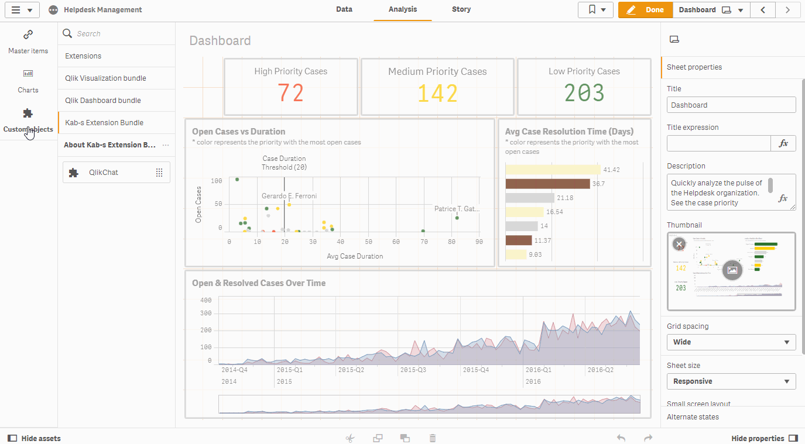

# qlik-chat
A Node.js (and Express) REST API for Qlik Sense Enterprise for Windows with a Qlik Sense example extension to show the API usage. The API come with CORS enabled and requires certificate from the Qlik Sense server (presuming it’s been deployed on the same server as Qlik Sense). It will create a new user and a database in the existing PostgreSQL database used by Qlik Sense and no additional software installation is required apart from nodejs.

_IMPORTANT! This was developed as a PoC, not to be used in production, especially the Qlik Sense extension._


# Why
Wanted to demonstrate how to build and deploy a REST API to add chat functionality in Qlik Sense without any additional database server or services.


# Contents
1. Prerequisites
2. [PostgreSQL user and Database creation via command prompt](#-PostgreSQL-user-and-Database-creation-via-command-prompt)
3. Setup the node-chatapi folder
    1. Copy the node-chatapi folder
    2. Add server certificate to the node-chatapi project
    3. Start the API
4. Setup Qlik Sense Extension
    1. Install the Qlik Sense extension
    2. Configure the Qlik Sense extension


# Setup
## Prerequisites
First make sure you have node.js installed in the environment. If you do not already have node.js installed then you can install node.js from [Here](https://nodejs.org/en/).

Download and unzip this repo to your server where you wish you run the API from. Make sure you have the PostgreSQL server install on the same server. If not you will have to change the config in the "node-chatapi" folder in file named "bd.js" as shown below - 

```javascript
const pool = new Pool({
  user: 'chatagent',
  host: 'localhost', //Server name where the PostgreSQL server is being hosted
  database: 'qlikchat',
  password: 'agentpass',
  port: 4432,
  //ssl: true //use this for Azure PostgreSQL db
})
```

## PostgreSQL user and Database creation via command prompt
Use your favourite windows Command-line tools (cmd, PowerShell etc) and run the following commands. *Please note - you will need your PostgreSQL super user password. This would have been created during Qlik Sense Installation.* 

_Location of the psql - this can vary depending on where Qlik Sense has been installed as well as the version of Qlik Sense._ 
```
cd %programfiles%\Qlik\Sense\Repository\PostgreSQL\9.6\bin
```

_Connect to the PostgreSQL instance using superuser (postgres). Superuser password is required to establish the connection._
```
psql -h localhost -p 4432 -U postgres
```

_Create a new database for the chat API_
```
CREATE DATABASE qlikchat;
```

_Create a new user the API will use to access the qlikchat db_
```
CREATE USER chatagent WITH ENCRYPTED PASSWORD 'agentpass';
```

_Grant privileges to the newly created user_
```
GRANT ALL PRIVILEGES ON DATABASE QlikChat TO chatagent;
GRANT postgres TO chatagent WITH ADMIN OPTION;
```

_Connect to the "qlikchat" db_
```
\c qlikchat;
```
_ONLY use this If you disconnect from the existing session and reconnecting back_
```
psql -h localhost -p 4432 -U chatagent qlikchat
```

_Run SQL statement to create a new table for the API_ 
```sql
--create table
CREATE TABLE public.qs_chat
(
    msg_id SERIAL PRIMARY KEY NOT NULL,
    user_id VARCHAR(50) NOT NULL,
    user_name VARCHAR(100) NOT NULL,
    app_id VARCHAR(50) NOT NULL,
    sheet_id VARCHAR(50) NOT NULL,
    object_id VARCHAR(50),
    message VARCHAR,
    is_private boolean NOT NULL DEFAULT false,
    bookmark VARCHAR,
    priority boolean NOT NULL DEFAULT false,
    created_on timestamp without time zone NOT NULL DEFAULT now()
);
```

That is all - PostgreSQL is now ready for the API. Run the following command to exit psql - 
```
\q 
```

#### Other useful commands for psql - 
```
--connection info
\conninfo

--Connect to a new database
\c

--List all tables
\dt

--List all roles
\du

--List databases
\list
```


## Setup the node-chatapi folder
### Copy the node-chatapi folder
Copy the "node_chatapi" folder to the server and place it where you wish to run the API from. 
```
ex: d:\node_chatapi
```

### Add server certificate to the node-chatapi project
Export the server certificate from Qlik Sense. follow this [link](https://help.qlik.com/en-US/sense-admin/November2019/Subsystems/DeployAdministerQSE/Content/Sense_DeployAdminister/QSEoW/Administer_QSEoW/Managing_QSEoW/export-certificates.htm) if you are not sure on how to do this. Once exported - copy and paste the `server.pem` and `server_key.pem` within "node_chatapi" folder. Update the `index.js` file with your password for the certificate (if you have set one during exporting it from Qlik Sense). This should look as below - 

```javascript
//Comment out this block if you are using http only.
https.createServer({
  key: fs.readFileSync('./server_key.pem'),
  cert: fs.readFileSync('./server.pem'),
  passphrase: '' //your certificate password goes here
}, app).listen(port, () => {
  console.log(`App running on port ${port}.`)
});
```

### Start the API
API is now configured. Fire up your command tool and navigate to the project folder and type `node index.js`. You should see a message in your terminal if all works well - `App running on port 3001`. Leave this running. You can use a REST client to test the API if you wish. Use your REST client and send a `GET` request to the following endpoint `https://[yourservername]:3001/allchat`. You should receive an empty object as we haven't yet produced any records in the newly created table. You should also see a message in your terminal window, stating a request was sent to this endpoint.


## Setup Qlik Sense Extension
### Install the Qlik Sense extension
Install the Qlik Sense extension found in this repo in `rootfolder\qs-ext\qlikChat.zip`. *Please note - This extension currently ONLY works with chrome, does not work with IE11 or Edge*. This extension is only to serve as an example of how to work with this API, feel free to create your own version. You can possibly port this current version to IE by converting all the arrow functions to function() statement. There are tools that can help you do this.

### Configure the Qlik Sense extension

Once the extension is installed on the server, you will find it under `Kab-s Extension Bundle` in the custom objects. Drag and drop the extension on the dashboard. Change the API host property in the following format `https://[servername]:3001` (no dash after the port). Save and reload the page and you are good to go! Enjoy commenting in your Qlik Sense dashboard.
